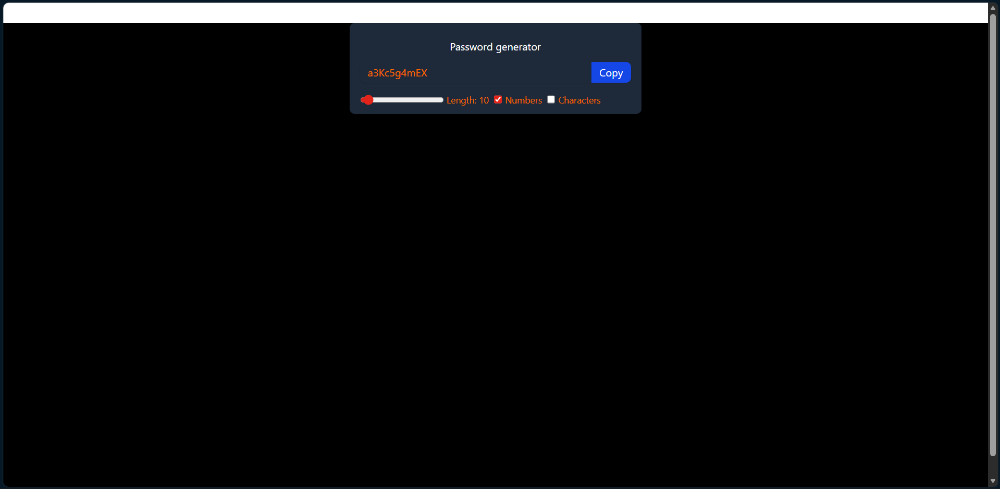

# 🔐 Password Generator

A simple and responsive Password Generator built using **React**, **Vite**, and **Tailwind CSS**.

## ✨ Features

* 🔢 Adjustable password length (6–100 characters)
* 🔣 Option to include numbers
* 🎯 Option to include special characters
* 📋 One-click copy to clipboard
* ✅ Copy confirmation feedback
* ⚡ Automatic password regeneration
* 🎨 Clean and responsive UI

## 🚀 Technologies Used

* React
* Vite
* Tailwind CSS
* JavaScript

## 📸 Preview




## 🛠️ Installation

```bash
git clone https://github.com/Adarsh2059/React_JS/tree/main/06_Password_Generator

npm install

npm run dev
```

## 📖 Usage

1. Select the password length using the slider.
2. Enable numbers if required.
3. Enable special characters if required.
4. Copy the generated password with one click.

## 🧠 React Concepts Used

* useState
* useEffect
* useCallback
* useRef

## 📂 Project Structure

```text
src/
├── assets/
├── App.jsx
├── main.jsx
└── index.css
```

## 🌟 Future Enhancements

* Password strength indicator
* Password history
* Theme switcher
* Custom character sets

## 📜 License

This project is open-source and available under the MIT License.

---

⭐ If you found this project useful, consider giving it a star!
